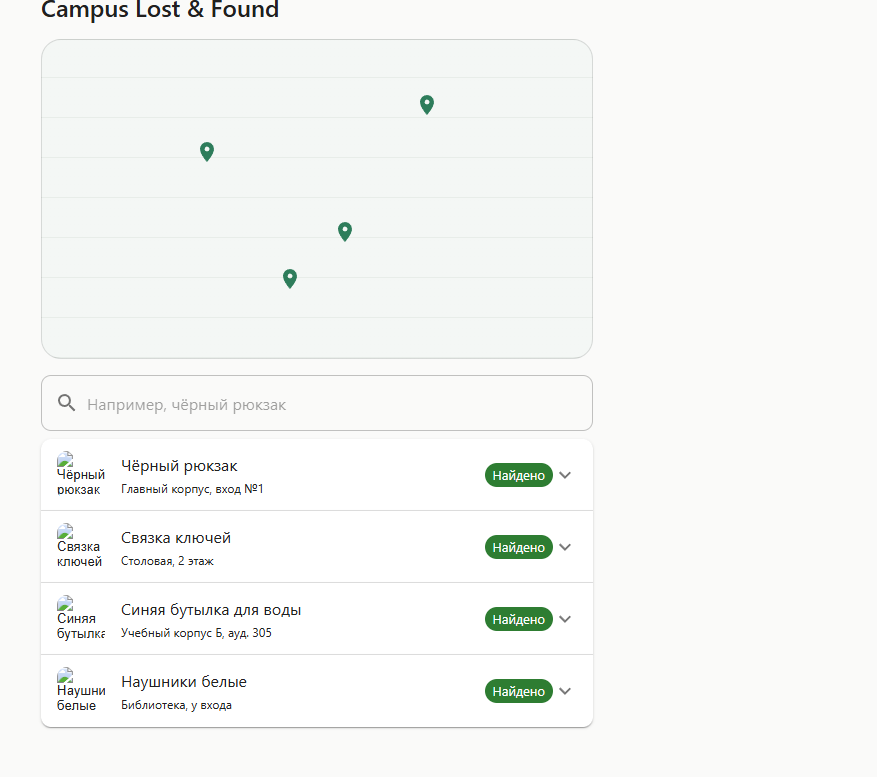
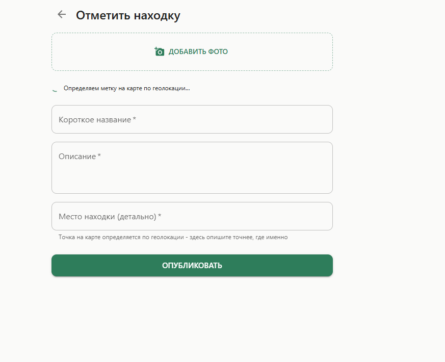

# Campus lost and found app

# Суть
Данная программа созданна для того чтобы люди могли находить потерянные вещь.


# сценарии
Сценарий "найти вещь": человек заходит на главный экран, видит карту с точками находок, вводит поисковый запрос, получает список отфильтрованных по релевантности объявлений под картой, кликает на нужное и разворачивается подробная карточка.
Сценарий "отметить находку": человек переходит на отдельный экран, добавляет фото найденной вещи, пишет описание и место, публикует - объявление появляется на главном экране.

# экраны


Главный экран это карта + поиск + список объявлений с разворачивающимися карточками
Экран публикации это форма с фото, описанием, местом.

Переходы между экранами - с главного экрана кнопкой переходим на экран публикации после публикации возврат на главный.

## Стек

React + TypeScript
React Router - клиентская маршрутизация
MUI (Material UI) - библиотека UI-компонентов
Vite - сборка и dev-сервер


## Установка и запуск

```bash
npm install
npm run dev
```

После `npm run dev` приложение доступно по адресу, который выведет
консоль (обычно `http://localhost:5173`).

Проверка типов и сборка:

```bash
npm run build
```

## Структура проекта
``` bash
tree /F  # (на windows)
```
```
campus-lost-and-found/
├── README.md
├── package.json
├── tsconfig.json
├── vite.config.ts
├── docs/
│   └── screenshots/
└── src/
    ├── main.tsx
    ├── App.tsx
    ├── app/
    │   └── routes.tsx
    ├── pages/
    │   ├── HomePage/
    │   │   └── HomePage.tsx
    │   └── ReportPage/
    │       └── ReportPage.tsx 
    ├── entities/
    │   └── listing/
    │       ├── model.ts
    │       └── mockData.ts
    ├── features/
    │   ├── search-listings/
    │   │   └── SearchBar.tsx
    │   └── report-listing/
    │       ├── PhotoCapture.tsx
    │       └── DescriptionForm.tsx
    └── shared/
        └── ui/
            ├── ListingCard.tsx
            └── MapView.tsx
```

## Скриншоты

Главный экран:



Экран публикации находки:



## Модель данных (моковая)

```ts
interface Listing {
  id: string;
  type: 'lost' | 'found';
  title: string;
  description: string;
  photoUrl: string;
  location: string;
  createdAt: string;
  x: number; // позиция на условной карте, %
  y: number;
}
```

## Заметки об упрощениях

Карта - условная, для лабы №1 важна навигация и интерфейс, а не
  геоданные.
Фото при публикации превращается в object URL в браузере  - временное решение до появления бэкенда.

## Статус
Каркас проекта создан (Vite + React + TypeScript). Роутинг между / и /report. Главный экран карта, поиск, список-аккордеон. Экран публикации фото, описание, место. Скриншоты экранов сохранены в docs/screenshots README с инструкцией запуска